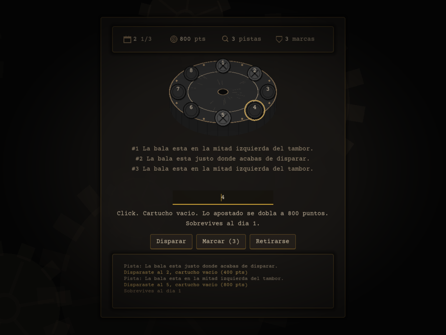
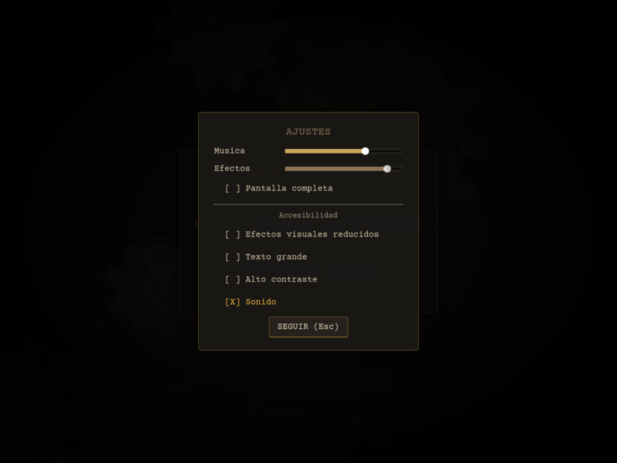
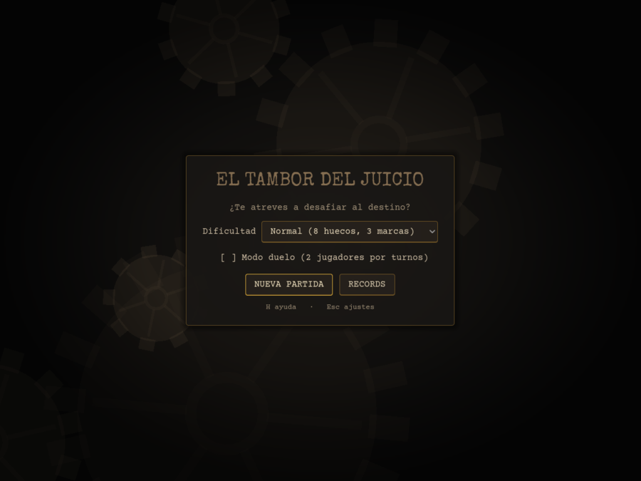
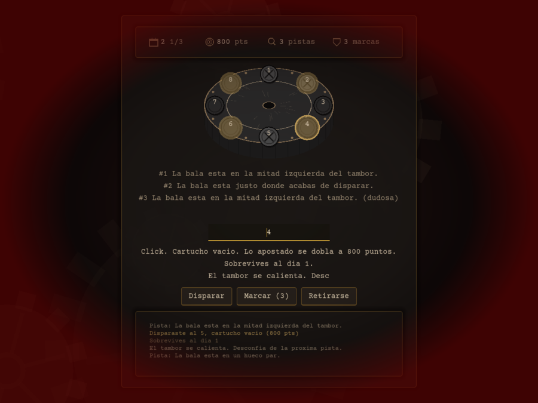
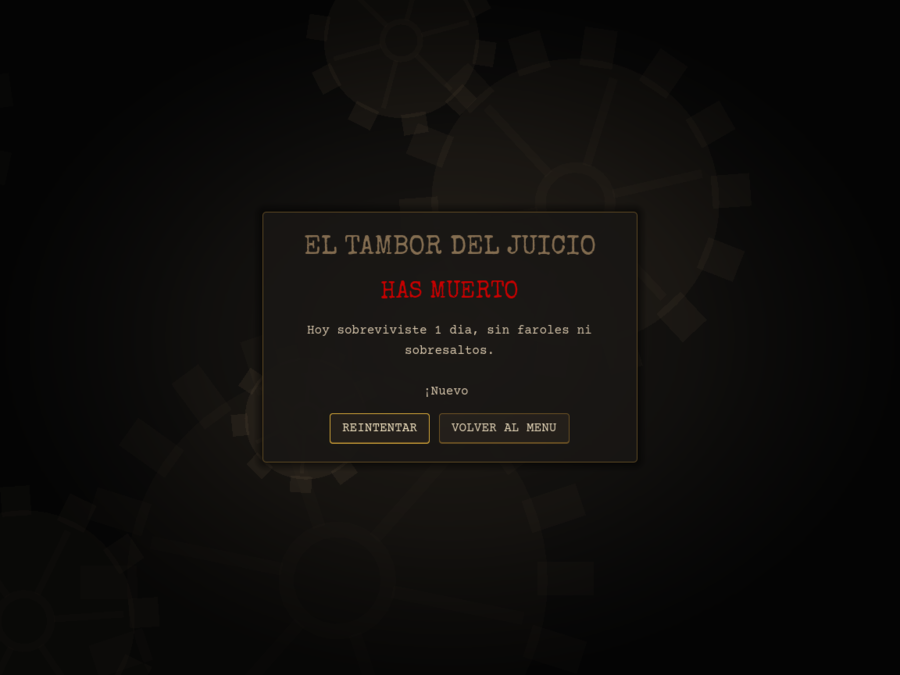
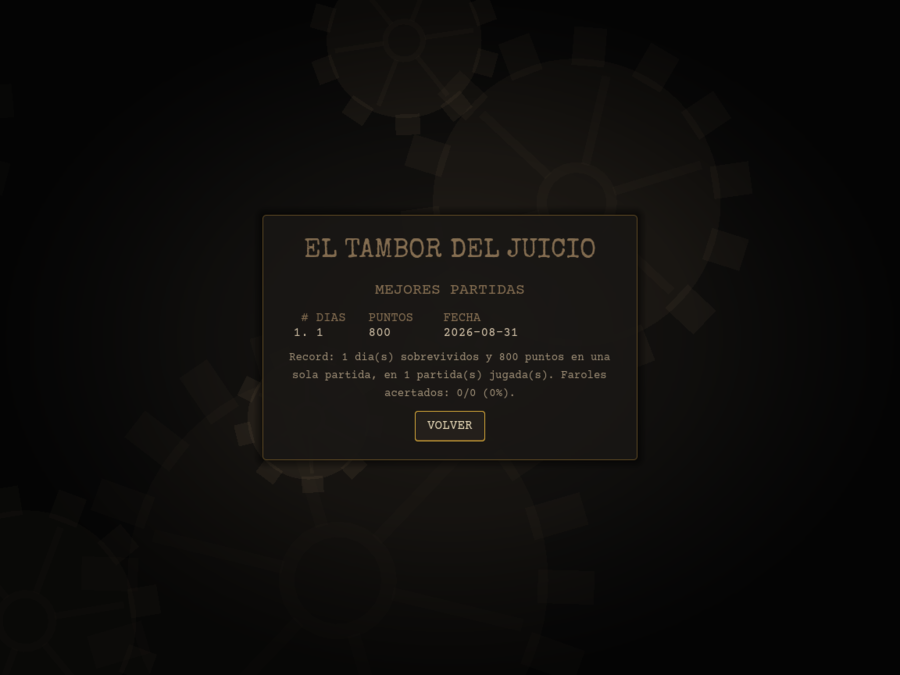

<p align="center">
  
</p>

<h1 align="center">🔫 Russian Roulette</h1>

<p align="center">
  <strong>¿Te sientes con suerte? El tambor gira y la bala te está esperando.</strong>
</p>

<p align="center">
  
  
  
  
  
</p>

---

<p align="center">
  
</p>

Una colección de minijuegos de ruleta rusa en **dos sabores**: un clásico de
**terminal** escrito en Python y una versión **gráfica 2D** hecha con Godot.
Desde esta beta, las dos versiones juegan **la misma mecánica**:
**El Tambor del Juicio**, un rediseño centrado en la gestión de riesgo y el
farol (ver [Hoja de ruta](#hoja-de-ruta) para el detalle fase a fase).

## 🧠 La idea

El tambor tiene **8 huecos** y una única bala que **se desplaza** tras cada
disparo que la falla, siguiendo un patrón oculto que debes deducir a partir
de las pistas (a veces mentirosas) y de eventos aleatorios. En cada turno
decides: **te retiras** con los puntos que llevas en juego, **disparas**
arriesgando que se **doblen** (o perderlo todo), o gastas una de tus 3
**marcas** para declarar un hueco seguro sin arriesgar el pellejo. El
objetivo no es una única partida: es acumular **días de vida**.

- **🐍 Terminal** — tambor ASCII con colores ANSI, tambor que **gira**
  al disparar y **late** en rojo cuando quedan pocos huecos, selector con
  las **flechas**, pistas escritas a máquina, carteles de evento a pantalla
  completa, panel fijo con tus datos, bitácora de las últimas acciones y
  **finales alternativos** según cómo hayas jugado.
- **🎮 Gráfica (Godot)** — misma mecánica en un taller en penumbra:
  engranajes girando en tres capas al fondo, **tambor de metal en escorzo**
  que gira sobre su eje y frena en seco en cada disparo, huecos que se
  eligen **con el ratón** y **laten** cuando las pistas los señalan, texto
  tecleado a máquina, **banda sonora de dos capas** que acelera y se
  encrespa según se vacía el tambor, y pantallas de récords y de final de
  partida.

> ⚠️ **Descargo de responsabilidad:** es solo un juego de ficción. No existe
> ninguna arma real. Solo diversión para la terminal y la pantalla.

## 📦 Requisitos

| Versión | Tecnología | Requisito |
|---------|-----------|-----------|
| Terminal | 🐍 Python | Python 3.11 o superior |
| Gráfica  | 🎮 Godot | Godot 4.7 o superior |

## ⬇️ Instalación (versión terminal)

La forma más cómoda de jugar es descargar el juego e instalar un **acceso
directo** en tu escritorio: con un doble clic el juego se abre solo.

**1. Descarga e instala [Python 3.11+](https://python.org/downloads/)** si aún
no lo tienes.

**2. Descarga e inicia el instalador:**

- **Linux / macOS** → descarga el proyecto (botón *Code ▾ → Download ZIP*),
  descomprime la carpeta y haz **doble clic** en `instalar.sh` (o en la
  terminal: `./instalar.sh`).
- **Windows** → haz **doble clic** en `instalar.bat`.

El instalador detecta Python, crea el acceso directo en el escritorio y abre
el juego directamente.

> 💡 Si el sistema bloquea el archivo por ser de Internet, abre la terminal y
> ejecútalo tú: `./instalar.sh`. En Windows, si aparece un aviso, pulsa
> *「Más información → Ejecutar de todas formas»*.

## 🚀 Lanzadores rápidos

Incluimos dos lanzadores para que el juego arranque directo sin teclear comandos:

| Archivo | Sistema | Qué hace |
|---------|---------|----------|
| `run.sh` | Linux / macOS | Lanza la ruleta; con `run.sh -g` abre Godot |
| `run.bat` | Windows | Lanza la ruleta; con `run.bat -g` abre Godot |

```bash
# Ejecutar el juego en la terminal (Linux / macOS)
./run.sh

# Con dificultad personalizada (reenvía los argumentos a ruleta.py)
./run.sh --huecos 6

# O abrir el editor Godot
./run.sh -g
```

## 🗂️ Estructura del repositorio

```
russian-roulette-2d/
├── README.md            ← esta documentación
├── LICENSE              ← licencia MIT
├── pyproject.toml       ← metadata, entry point y config de ruff/black/coverage
├── instalar.sh          ← instalador + acceso directo (Linux / macOS)
├── instalar.bat         ← instalador (Windows)
├── run.sh               ← lanzador Linux / macOS
├── run.bat              ← lanzador Windows
├── .github/workflows/   ← CI (tests Python + smoke test Godot)
├── docs/
│   ├── GUIA.md          ← guía técnica del proyecto
│   └── img/             ← capturas de la versión gráfica
├── terminal/            ← versión de consola: El Tambor del Juicio
│   ├── ruleta.py        ← interfaz de terminal (pantalla, teclado, colores)
│   ├── estado.py        ← tambor y bala: posición, patrón, días de vida
│   ├── pistas.py        ← generación de pistas (veraces o mentirosas)
│   ├── apuestas.py      ← apuesta doblar-o-retirarse
│   ├── farol.py         ← marcar un hueco como seguro sin disparar
│   ├── eventos.py       ← eventos aleatorios (clic metálico, tambor caliente)
│   ├── historial.py     ← contadores de la partida y resumen narrativo
│   ├── records.py       ← récords persistidos en ~/.tambor_del_juicio/
│   └── test_*.py        ← pruebas unitarias de los ocho módulos
└── 2d/                  ← versión gráfica: El Tambor del Juicio
    ├── project.godot    ← proyecto Godot
    ├── RuletaEstado.gd  ← orquestador: conecta la lógica y emite señales
    ├── TamborJuicio.gd  ← tambor y bala: posición, patrón, días de vida
    ├── Pistas.gd        ← generación de pistas (veraces o mentirosas)
    ├── Apuesta.gd       ← apuesta doblar-o-retirarse
    ├── Farol.gd         ← marcar un hueco como seguro sin disparar
    ├── Eventos.gd       ← eventos aleatorios (clic metálico, tambor caliente)
    ├── Historial.gd     ← contadores de la partida y resumen narrativo
    ├── Jugador.gd       ← apuesta/marcas/disparos de un jugador y desempate
    ├── Dificultad.gd    ← presets fácil/normal/difícil
    ├── Records.gd       ← récords persistidos en user://records.json
    ├── Ajustes.gd       ← accesibilidad y mezcla, en user://ajustes.json
    ├── MainGame.gd      ← vista: las cuatro pantallas y su cableado
    ├── TamborView.gd    ← dibuja el tambor, lo gira y escucha al ratón
    ├── FondoTaller.gd   ← engranajes y luz del fondo
    ├── Vineta.gd        ← viñeta, resplandores de evento y cierre en iris
    ├── Maquina.gd       ← texto tecleado letra a letra
    ├── Paleta.gd        ← los cinco colores del juego, en un solo sitio
    ├── Icono.gd         ← iconos del HUD, dibujados con _draw()
    ├── tests/           ← scripts headless (lógica + integración de escena)
    ├── scenes/          ← escenas (UI)
    └── assets/          ← audio y tema (sintetizados/dibujados) + fuentes
```

## 🐍 Versión de terminal (Python) — El Tambor del Juicio

Ya no es solo elegir un número: gestionas pistas y una apuesta que se dobla
mientras te atrevas a seguir.

### Cómo jugar

Desde la raíz del repositorio:

```bash
./run.sh                       # usa el lanzador (Linux / macOS)
# o directamente:
cd terminal && python3 ruleta.py
```

> 💡 En Windows usa `run.bat`, o `python ruleta.py` en lugar de `python3`.

### Reglas

1. El tambor tiene **8 huecos** y una única bala colocada al azar. La
   partida no acaba en la primera muerte: lo que se mide es cuántos **días
   de vida** aguantas (cada día son 3 disparos sobrevividos).
2. En cada turno eliges entre **(D)isparar**, **(R)etirarte** o, si te
   quedan, **(M)arcar** un hueco como seguro:
   - **Retirarte** cobra los puntos que llevas en juego (empiezas con 100)
     y termina la partida ahí.
   - **Disparar** y **fallar** (cartucho vacío) → 😅 dobla los puntos en
     juego, desplaza la bala a otro hueco según un patrón oculto y te da
     una pista sobre dónde está ahora.
   - **Disparar** y **acertar** la bala → 💥 *BOOM*, pierdes todo lo que
     tenías en juego. Ahí acaba la partida (se te dice cuántos días
     sobreviviste).
   - **Marcar** es un farol de bajo riesgo: declaras un hueco "seguro" sin
     disparar. Tienes **3 marcas por partida**; cada uso gasta una, acierte
     o falle. Si aciertas ganas **+50 puntos** sin doblar; si fallas solo
     pierdes la marca — la bala no se mueve y la partida sigue.
3. Las pistas se acumulan turno a turno: compáralas para deducir el patrón
   de movimiento (avanza, retrocede, salta de dos en dos o rebota en
   espejo). Ojo: no siempre son de fiar (ver eventos abajo).
4. De vez en cuando ocurre un **evento aleatorio** tras un disparo:
   - *"Se oye un clic metálico"* → la bala da un paso extra, fuera de su
     patrón habitual.
   - *"El tambor se calienta"* → la siguiente pista **miente** (dice justo
     lo contrario de la verdad), sin avisar cuál fue.
5. El tambor ASCII colorea cada hueco con lo que sabes de él:
   - 🟡 **amarillo** `?` — candidato: cumple con **todas** las pistas
     vigentes (se cruzan entre sí). Si de repente no queda ninguno en
     amarillo, alguna pista reciente no encajaba... quizá te mintieron.
   - 🟢 **verde** `✓` / 🔴 **rojo** `✗` — resultado de un farol: confirmaste
     que ahí no había bala, o que sí la había, en ese momento.
   - ⚪ **gris** `·` — ya disparaste ahí alguna vez.
6. Al terminar la partida (mueras o te retires) se muestra un resumen
   narrativo de lo que ha pasado —días sobrevividos, faroles lanzados y
   acertados, eventos que sufriste— y un **epílogo** que cambia según cómo
   hayas jugado: no es lo mismo caer el primer día que retirarte con diez
   a la espalda, o sobrevivir sin gastar una sola marca.
7. Con `--oscuridad` el tambor se apaga (`▒`): solo ves los huecos que ya
   has disparado o faroleado tú. Los candidatos que dejan las pistas dejan
   de resaltarse y hay que llevar la deducción en la cabeza.

### La terminal como escenario

La versión de terminal no se limita a imprimir el estado: usa lo que la CLI
sabe hacer para montar la escena.

| Recurso | Qué hace |
|---------|----------|
| 🎞️ **Giro del tambor** | Al disparar, el resaltado da una vuelta completa y frena poco a poco hasta pararse en el hueco elegido. |
| 💓 **Latido** | Cuando quedan 3 huecos o menos sin probar, el marco del tambor parpadea en rojo con un ritmo que acelera. |
| ⌨️ **Selector con flechas** | `←` y `→` recorren el tambor, `Enter` confirma y `Esc` se echa atrás sin gastar el turno (también valen los dígitos y `a`/`d`). Donde no se puede leer tecla a tecla —un *pipe*, CI— se vuelve a teclear el número de siempre. |
| 🖨️ **Pistas a máquina** | Cada pista nueva se imprime carácter a carácter, como una teletipo. |
| 📰 **Carteles de evento** | Un `clic metálico` o un `tambor caliente` ocupan la pantalla entera durante un par de segundos antes de devolverte al juego. |
| 📋 **Panel fijo y bitácora** | Arriba, siempre en el mismo sitio: día, disparo, puntos en juego, marcas y pistas. Abajo, las últimas 5 acciones con un color por tipo. |
| 🔔 **Sonido** | El timbre de la terminal (BEL) marca cada momento con un ritmo distinto: un pip seco al sobrevivir, tres al acertar un farol, una ráfaga al morir, un zumbido cuando el tambor se calienta. No tiene tono que ajustar, así que lo que cambia es la cadencia. |
| 🌑 **Modo a oscuras** | `--oscuridad` tapa todo lo que no hayas comprobado tú mismo. |
| 🎬 **Finales alternativos** | El epílogo cambia según los días, las marcas gastadas y si te fuiste por tu propio pie. |

Todo eso se apaga de una vez con `--sin-animaciones` (nada duerme, nada
parpadea y la partida se convierte en un registro que va bajando: es lo
que quieres al redirigir la salida a un fichero, en CI o con un lector de
pantalla) y `--sin-sonido` calla el timbre. El sonido se desactiva solo si
la salida no es una terminal de verdad.

```bash
python3 ruleta.py --oscuridad              # el tambor solo muestra lo comprobado
python3 ruleta.py --sin-animaciones        # sin giros, latidos ni pausas
python3 ruleta.py --sin-sonido             # sin timbre
```

### Dificultad personalizada

Tres presets (`--dificultad facil|normal|dificil`) ajustan a la vez el
tamaño del tambor y las marcas de farol por partida; `--huecos`/`--marcas`
sueltos afinan cualquiera de los dos por separado (y pisan al preset si
se combinan con él):

| Dificultad | Huecos | Marcas |
|:----------:|:------:|:------:|
| `facil`    | 10     | 4      |
| `normal` (por defecto) | 8 | 3 |
| `dificil`  | 6      | 2      |

```bash
cd terminal && python3 ruleta.py --dificultad dificil
python3 ruleta.py --huecos 6 --marcas 1   # a medida, sin usar un preset
python3 ruleta.py --help       # ver todas las opciones
python3 ruleta.py --version    # version instalada (o aviso si se ejecuta sin instalar)
```

> 💡 Con `pip install -e .` el comando instalado es `ruleta`, con las mismas
> opciones (`ruleta --dificultad dificil`).

### Récords

Cada partida (en solitario o en un duelo) actualiza un fichero de récords
en `~/.tambor_del_juicio/records.json`: días máximos sobrevividos, puntos
máximos en una partida, partidas jugadas y faroles acertados/usados.
Se guarda solo, y `--records` los muestra sin jugar:

```bash
python3 ruleta.py --records
```

Si superas tu récord de días, la pantalla final de esa partida lo anuncia.

### Modo duelo

`--duelo` enfrenta a dos jugadores por turnos **en el mismo tambor**: la
bala, su patrón y las pistas acumuladas son compartidas (es literalmente
el mismo revólver), pero cada jugador tiene su propia apuesta y sus
propias marcas de farol. La partida termina en cuanto el turno de uno de
los dos acaba en **BOOM** o en retirada — el otro no sigue jugando después
— y gana quien haya sobrevivido más días (en caso de empate, quien tenga
más puntos):

```bash
python3 ruleta.py --duelo
python3 ruleta.py --duelo --dificultad facil   # combinable con dificultad
```

### Ejemplo de partida

```
╔══════════════════════════════════════════════════╗
║               EL TAMBOR DEL JUICIO               ║
╟──────────────────────────────────────────────────╢
║  Dia 2  · disparo 1/3    En juego 900 pts        ║
║  Marcas 2                Pistas 3                ║
╚══════════════════════════════════════════════════╝

   Pistas del tambor:
   #1 La bala esta en la mitad derecha del tambor.
   #2 La bala no esta en los huecos pares.
   #3 La bala no esta en los huecos pares.

   ┌───┬───┬───┬───┬───┬───┬───┬───┐
   │ · │ · │ · │ 0 │ ? │ 0 │ ✓ │ 0 │
   └───┴───┴───┴───┴───┴───┴───┴───┘
     1   2   3   4   5   6   7   8

   ── bitacora ──
   › Disparo al 1: vacio (200 pts)
   › Tambor caliente
   › Farol en el 7: vacio (+50 pts)
   › Disparo al 3: vacio (900 pts)
   › Amanece el dia 2.

   (D)isparar, (R)etirarse o (M)arcar [2]: r

    ✦  TE RETIRAS A TIEMPO  ✦

   Cobras 900 puntos tras 3 disparo(s) (1 dia(s) sobrevivido(s)).
   Hoy sobreviviste 1 dia y faroleaste 1 vez (1 acertado).

   ── TE RETIRAS A TIEMPO ──
   1 dia(s) y 900 puntos en el bolsillo. La puerta estaba abierta
   y, por una vez, la usaste.
```

En este tambor de 8, cruzar "mitad derecha" (5-8) con "no par" (1,3,5,7) deja
solo el 5 y el 7 como candidatos (amarillo `?`); el 7 ya se marcó y salió
seguro (verde `✓`); el 1, 2 y 3 son huecos por los que ya se disparó (gris `·`).
Debajo, la bitácora recuerda las últimas cinco cosas que pasaron, y el
epílogo cierra la partida según cómo se jugó.

- 💀 Aciertas la bala → **BOOM**, pierdes todo lo apostado (fin de la partida).
- 😅 Fallas un disparo → los puntos en juego se **doblan** y sigues con una
  pista más (y, a veces, un evento).
- 🃏 Marcas un hueco → sin riesgo de muerte: ganas un bono si aciertas,
  solo pierdes la marca si fallas.
- 🏳️ Te retiras cuando quieras y te llevas lo que llevabas en juego.

## 🎮 Versión gráfica (Godot 2D) — El Tambor del Juicio

La versión gráfica juega **la misma mecánica que la terminal** (las
cuatro fases del rediseño): tambor de bala móvil, pistas, apuesta
doblar-o-retirarse, farol, días de vida, dificultad, récords y modo
duelo — puesta en un taller noir/steampunk en penumbra.

La partida entera está **dibujada por código** (`_draw()`) y **sonada por
código** (WAV sintetizados con la librería estándar de Python): no hay
sprites ni samples de terceros, solo las dos tipografías. Eso incluye los
engranajes que giran al fondo, la luz cálida sobre el tambor, la chapa y
los remaches del propio tambor, la viñeta de los bordes y el aspecto de
latón de botones y campos.

### Cómo jugar

1. Abre Godot e importa el proyecto desde `2d/project.godot`.
2. Pulsa **▶ Play** (o la tecla **F5**).
3. En el **menú** eliges dificultad y, si quieres, marcas *Modo duelo* y
   pones los nombres de los dos jugadores. Pulsa **NUEVA PARTIDA** (o
   **RÉCORDS** para ver la tabla de mejores marcas).
4. **Pincha un hueco del tambor** —se ilumina al pasar por encima y se
   queda marcado al hacer clic— o escribe su número. Después,
   **Disparar**, **Marcar** o **Retirarse** (las mismas acciones que en la
   terminal, ver [Reglas](#reglas) más arriba).
5. Al morir o retirarte se abre la **pantalla de final** con el resumen, y
   desde ahí puedes **REINTENTAR** con la misma configuración o volver al
   menú.

| Tecla | Qué hace |
|-------|----------|
| **Enter** | Dispara al hueco elegido |
| **H** | Abre y cierra la ayuda |
| **Esc** | Abre y cierra los ajustes (volumen, pantalla completa, accesibilidad) |

El tambor se colorea igual que en la terminal: 🟡 amarillo = candidato
según las pistas vigentes (y además **late**), 🟢 verde / 🔴 rojo =
resultado de un farol, ⚪ gris = ya disparado (con un aspa encima, para que
se distinga también sin depender del color).

Los dos eventos aleatorios se ven y se oyen: el **clic metálico** suena a
engranaje, cruza un reflejo por la chapa y sacude la pantalla; el **tambor
caliente** enrojece la luz del taller, hace destellar los huecos que señala
la pista siguiente y la deja marcada como `(dudosa)` en la lista, que es
justo lo que el evento acaba de anunciar por escrito.

Donde la terminal usa opciones de línea de comandos (`--dificultad`,
`--duelo`, `--records`), aquí están en el menú y en la pantalla de récords;
y donde la terminal vuelve al prompt al terminar una partida, aquí está la
pantalla de final. Los récords se guardan en `user://records.json` (el
equivalente idiomático en Godot de `~/.tambor_del_juicio/records.json`), y
ahí van también las cinco mejores partidas con su fecha.

### Accesibilidad y ajustes (tecla Esc)



Todo se recuerda entre partidas en `user://ajustes.json`:

| Ajuste | Qué hace |
|--------|----------|
| **Música** / **Efectos** | Dos mezclas independientes (buses de audio). |
| **Pantalla completa** | Ventana o pantalla completa. |
| **Efectos visuales reducidos** | Para en seco todo lo que se mueve solo: engranajes, latido de los huecos, parpadeo de la luz, vibración de pantalla y tecleo del texto; el giro del tambor se acorta. De paso, con esto el juego no repinta nada por fotograma: es la opción para una máquina modesta. |
| **Texto grande** | Sube el cuerpo de toda la tipografía, iconos del HUD incluidos. |
| **Alto contraste** | Aclara los textos y sube el tono de los colores del tambor, a costa de la penumbra. |
| **Sonido** | Efectos y música (el equivalente de `--sin-sonido` en la terminal). |

<br clear="right">

### Capturas

<table>
  <tr>
    <td width="50%"></td>
    <td width="50%"></td>
  </tr>
  <tr>
    <td align="center"><em>El taller, antes de empezar.</em></td>
    <td align="center"><em>«Tambor caliente»: desconfía de la próxima pista.</em></td>
  </tr>
  <tr>
    <td></td>
    <td></td>
  </tr>
  <tr>
    <td align="center"><em>El final, con el resumen de la partida.</em></td>
    <td align="center"><em>Las mejores marcas, con su fecha.</em></td>
  </tr>
</table>

### Arquitectura: lógica pura + señales, igual que en Python

`2d/RuletaEstado.gd` orquesta `TamborJuicio.gd`, `Apuesta.gd`, `Farol.gd`,
`Eventos.gd`, `Historial.gd` y `Jugador.gd` — sin conocer nodos ni UI, ni
tocar disco, igual que `terminal/estado.py` y compañía — y emite señales
(`disparo_sobrevivido`, `pista_nueva`, `evento_ocurrido`,
`farol_resuelto`, `dia_completado`, `impacto`, `retirada`,
`turno_cambiado`, `duelo_terminado`...) que `MainGame.gd` escucha para
actualizar Label/Button/Tween. `TamborView.gd` solo sabe pintar el estado
que le pasa `MainGame.gd`, sin conocer ninguna regla del juego, y lo mismo
vale para los nodos de ambientación (`FondoTaller.gd`, `Vineta.gd`) y para
el tecleo del texto (`Maquina.gd`): son decorado que recibe órdenes, no
piezas que sepan lo que está pasando en la partida.

Una partida en solitario es, internamente, **un duelo de un solo
jugador**: los dos modos comparten la misma lógica de turnos
(`RuletaEstado.jugadores` y `turno`), y los atajos `apuesta`/`farol`/
`historial`/`disparos` apuntan siempre al jugador activo.

### Tests

Godot no trae un framework de tests instalado en el proyecto (ni
[GUT](https://github.com/bitwes/Gut) ni similar); en su lugar hay dos
scripts headless en `2d/tests/`, a modo de arnés mínimo:

```bash
cd 2d
godot --headless --script res://tests/test_logica.gd --path .    # RuletaEstado y sus módulos, sin nodos
godot --headless --script res://tests/test_escena.gd --path .    # MainGame.tscn real: menú, disparo, farol, duelo
```

Ambos salen con exit code 0 si todo pasa, 1 si algo falla (y lo imprime);
la CI (`godot-smoke-test`) los ejecuta en cada push/PR, junto al
`--check-only` que ya había. Los tests que tocan récords escriben en un
archivo aparte y lo borran al terminar, así que **no pisan los récords
de quien los ejecuta**.

## 🧰 Herramientas de desarrollo

- **Editor**: cualquiera (VS Code, Neovim, Godot editor...).
- **Control de versiones**: Git.
- **Empaquetado**: `pyproject.toml` con entry point instalable
  (`pip install -e .` deja disponible el comando `ruleta`).
- **Lint, formato y tipos**: [ruff](https://docs.astral.sh/ruff/),
  [black](https://black.readthedocs.io/) y [mypy](https://mypy.readthedocs.io/),
  configurados en `pyproject.toml` (`line-length = 88`,
  `target-version = "py311"`, `disallow_untyped_defs` para `ruleta.py`):

  ```bash
  pip install -e ".[dev]"
  ruff check .
  black --check .
  mypy
  ```

- **Pruebas y cobertura**: los juegos se pueden verificar desde línea de
  comandos con Godot `--headless` para la versión gráfica, y ejecutando el
  script para la terminal. La versión Python incluye una batería de tests
  por módulo (`terminal/test_*.py`), medida con
  [coverage.py](https://coverage.readthedocs.io/):

  ```bash
  cd terminal && python3 -m unittest discover -s . -v
  # o, con cobertura, desde la raiz del repositorio:
  coverage run -m unittest discover -s terminal && coverage report
  ```

- **Integración continua**: GitHub Actions (`.github/workflows/ci.yml`) corre
  en cada push/PR el lint, el formato, los tests con cobertura (matriz Python
  3.11-3.13) y un smoke test de Godot en modo `--headless`.

## 🧭 Hoja de ruta

### ✅ Hecho en esta beta `v0.1.0`
- [x] **El Tambor del Juicio** en las dos versiones (terminal y Godot):
  bala móvil, pistas, apuesta doblar-o-retirarse, farol, eventos y días
  de vida — ver el detalle fase a fase más abajo
- [x] **Lanzadores** para Linux, macOS y Windows (`run.sh`, `run.bat`)
- [x] **Instalador** con acceso directo en el escritorio (`instalar.sh`, `instalar.bat`)
- [x] **Tests** automáticos de la versión Python (99% de cobertura) y dos
  scripts headless para la versión Godot (lógica + integración de escena)
- [x] **Empaquetado** con `pyproject.toml` (entry point instalable, config de lint/formato/tipos)
- [x] **Integración continua** en GitHub Actions (tests + lint + tipos de
  Python, `--check-only` + tests headless de Godot)
- [x] **Lógica separada de la UI** en ambas versiones (estado con señales
  o retorno de valores, sin polling)
- [x] **Feedback visual** por colores en la versión Godot, ahora también
  por estado de hueco (paleta noir/steampunk)
- [x] **Selector de dificultad** en ambas versiones (presets
  fácil/normal/difícil: por CLI en la terminal, en el menú en Godot)
- [x] **Récords persistidos** entre partidas y **modo duelo** local por
  turnos con el tambor compartido, también en ambas versiones
- [x] **Efectos de sonido** de disparo, victoria y derrota (versión Godot)
- [x] **Animación del tambor** — giro al empezar partida, tensión antes de
  revelar un disparo o farol, y vibración de pantalla al morir (Godot)
- [x] **Atmósfera en la terminal** — giro y latido del tambor, selector con
  flechas, pistas escritas a máquina, carteles de evento, panel fijo,
  bitácora, timbre por patrones de ritmo, modo a oscuras y finales
  alternativos (ver [La terminal como escenario](#la-terminal-como-escenario))
- [x] **Ambientación completa de la versión gráfica** — taller con
  engranajes, luz que reacciona a los eventos, texto tecleado, bordón
  sonoro en bucle y tema de chapa y latón (ver el detalle más abajo)
- [x] **Accesibilidad** en la versión gráfica: efectos reducidos, texto
  grande, alto contraste y sonido, recordados entre partidas

### 🃏 Rediseño «El Tambor del Juicio»

Las dos versiones migraron de "elige un número" a un juego de gestión de
riesgo y farol, y ya juegan **la misma mecánica** (Fases 1-3 completas en
ambas):

- [x] **Fase 1 — Terminal:** bala móvil con patrón oculto, pistas veraces y
  apuesta doblar-o-retirarse (`estado.py`, `pistas.py`, `apuestas.py`)
- [x] **Fase 1 — Godot:** la misma mecánica en `TamborJuicio.gd`,
  `Pistas.gd` y `Apuesta.gd`, orquestados por `RuletaEstado.gd`
- [x] **Fase 2 — Terminal:** farol (marcar huecos, `farol.py`), eventos
  aleatorios que mueven la bala o falsean una pista (`eventos.py`) y
  objetivo de "días de vida" (`estado.dias_sobrevividos`, 3 disparos/día)
- [x] **Fase 2 — Godot:** lo mismo en `Farol.gd`, `Eventos.gd` y
  `RuletaEstado.dias_sobrevividos()`, con botón de Marcar en la UI
- [x] **Fase 3 — Terminal:** tambor coloreado por estado de hueco (verde
  seguro / rojo peligro / amarillo candidato según el cruce de pistas
  vigentes / gris ya disparado, `pistas.interseccion`) e historial
  narrativo al terminar la partida (`historial.py`)
- [x] **Fase 3 — Godot:** mismos cuatro colores en `TamborView.gd` (paleta
  noir/steampunk: metal envejecido y laton en vez de rojo/verde "de
  manual"), vibración de pantalla al morir, `Historial.gd` con el mismo
  resumen narrativo y **tipografía de máquina de escribir** (Courier Prime
  en toda la interfaz, Special Elite en el título)
- [x] **Fase 4 — Terminal:** opciones de dificultad por preset
  (`--dificultad facil|normal|dificil`, o `--huecos`/`--marcas` sueltos),
  récords persistidos entre partidas (`records.py`,
  `~/.tambor_del_juicio/records.json`, con aviso de "nuevo récord" en la
  pantalla final) y modo duelo local por turnos (`--duelo`,
  `jugar_duelo()`): mismo tambor/pistas compartidos, apuesta y marcas
  propias de cada jugador, termina en el primer BOOM o retirada
- [x] **Fase 4 — Godot:** lo mismo, en un menú previo a la partida en vez
  de por CLI: `Dificultad.gd` (mismos tres presets), `Records.gd`
  (`user://records.json`, con aviso de "nuevo récord") y duelo local por
  turnos con `Jugador.gd` + `RuletaEstado.jugadores`/`turno` — donde una
  partida en solitario es, internamente, un duelo de un solo jugador

Con eso, **las cuatro fases del rediseño están completas en las dos
versiones**.

- [x] **Fase 5 — Terminal:** la CLI como escenario. Primitivas de terminal
  en `efectos.py` (borrado sin parpadeo con códigos ANSI en vez de lanzar
  `clear`, tecleo letra a letra, timbre por patrones de ritmo, repintado
  de un bloque en el sitio), teclado en crudo en `entrada.py` (selector con
  `←`/`→`/`Enter`/`Esc`, con vuelta al número tecleado donde no hay
  terminal) y narrativa en `ambiente.py` (frase de ambiente al amanecer
  cada día, carteles de evento a pantalla completa y ocho finales
  alternativos). Encima de eso: giro del tambor al disparar, latido en rojo
  cuando quedan pocos huecos, panel fijo con día/puntos/marcas/pistas,
  bitácora de las últimas acciones (`historial.Accion`), modo a oscuras
  (`--oscuridad`) e interruptores `--sin-animaciones`/`--sin-sonido`

### 🕯️ Ambientación de la versión gráfica

Con la mecánica ya igualada, la versión de Godot se puso a la altura de la
terminal en atmósfera. Todo dibujado y sintetizado por código, sin assets
de terceros más allá de las dos tipografías:

- [x] **Un taller, no un fondo liso** — engranajes girando a distinta
  velocidad y profundidad (`FondoTaller.gd`), luz cálida sobre el tambor
  que parpadea como una lámpara de gas, y viñeta que oscurece los bordes
  (`Vineta.gd`)
- [x] **Tambor con volumen** — chapa, aros de latón, remaches, eje y
  sombra bajo cada hueco; los candidatos **laten** mientras las pistas los
  señalen (`TamborView.gd`)
- [x] **Eventos que se ven y se oyen** — el clic metálico suena a
  engranaje y sacude la pantalla; el tambor caliente enrojece la luz,
  acelera el bordón, hace destellar los huecos de la pista siguiente y la
  marca como `(dudosa)`
- [x] **Texto de máquina de escribir de verdad** — los mensajes se teclean
  letra a letra (`Maquina.gd`), y una línea añadida no reescribe lo que ya
  se estaba leyendo
- [x] **Final de partida con cierre en iris** — la pantalla se cierra
  sobre el resultado antes de volver al menú, dentro de la misma pausa de
  siempre
- [x] **Sonido nuevo**: `engranaje`, `marca`, `fallo` y un `ambiente` en
  bucle de 6 s hecho para encadenar sin costura, que sube de volumen en
  partida y acelera con el tambor caliente
- [x] **Chapa y latón en la interfaz** — `Theme` propio
  (`assets/tema/juicio.tres`) para botones, campos, desplegable,
  deslizadores y el panel que enmarca el juego, con las casillas marcadas
  a máquina (`[X]`/`[ ]`)
- [x] **Paleta cerrada de cinco colores** (`Paleta.gd`): negro, gris plomo,
  bronce envejecido, óxido y un rojo punzante reservado al peligro
- [x] **El tambor como pieza de metal** — cilindro en escorzo con su canto
  estriado, chapa rayada, remaches y eje; gira sobre su eje al disparar
  (coge carrerilla y frena en seco) mientras la cámara se acerca, y suelta
  chispas por el hueco donde estaba la bala
- [x] **Se juega con el ratón** — los huecos se iluminan al pasar por
  encima y se quedan marcados al pincharlos, sin dejar de poder teclear el
  número
- [x] **HUD y bitácora** — barra superior con día, puntos, pistas y marcas
  (iconos dibujados con `_draw()`, `Icono.gd`) y panel inferior con las
  cinco últimas acciones, cada una del color de lo que pasó
- [x] **Banda sonora de dos capas** a 70 pulsos por minuto: un piano en La
  menor que suena siempre y una capa de latido y tritono que entra cuando
  quedan tres huecos o menos, las dos acelerando conforme se vacía el tambor
- [x] **Cuatro pantallas** — menú con título y subtítulo, récords con la
  tabla de las cinco mejores partidas y su fecha, partida, y final con el
  resumen y un botón de reintentar
- [x] **Ayuda (H) y ajustes (Esc)** — panel de ayuda mecanografiado y menú
  de ajustes con volumen de música y efectos por separado, pantalla
  completa y las opciones de accesibilidad

### 🎯 Otros próximos pasos
- [ ] Modo «borracho» 🍺 (menos suerte y más humor)
- [ ] Empaquetado en un ejecutable único (`pyinstaller`)

## 🤝 Cómo contribuir

1. Haz un *fork* del proyecto.
2. Crea una rama: `git checkout -b mi-mejora`.
3. Realiza tus cambios y haz un commit claro.
4. Abre una *pull request*.

## 📄 Licencia

Este proyecto se distribuye bajo la licencia **MIT**. Consulta el archivo
[`LICENSE`](LICENSE) para más detalles.

---

<p align="center">
  <em>Hecho para pasar el rato. Si te toca la bala... siempre puedes reiniciar. 🎰</em>
</p>
